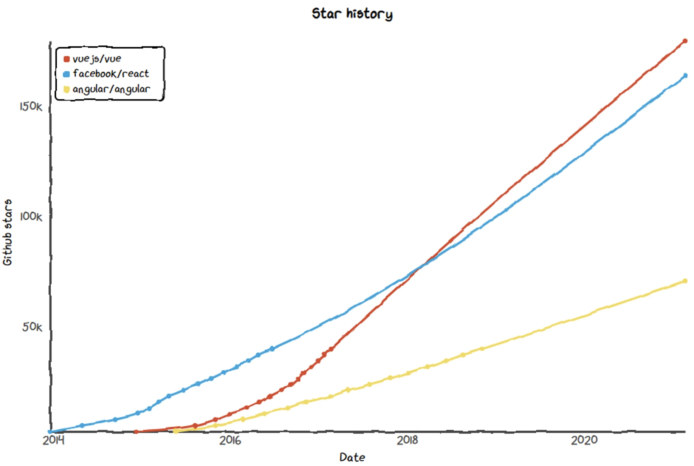

# VUEzards

First off LibreScan needs a user-friendly, intuitive and familiar web based frontend.
Lowering the entry barrier for blockchain & cryptocurrency users is a key mission of LibreScan, and doing that starts with a UI which is as easy as it gets.

Rule of thumb is that anything that needs a user-manual to be read is not worth using for the consumer!

---

## Choice of framework

The frontend framework of choice is [Vue3](https://v3.vuejs.org).

There are various reasons why Vue3 ended up as the winner here as follows:

## Masses can read & understand it

If you know HTML + JS + CSS chances are you will have no trouble understanding Vue code.
React & Angular are way more intrusive and use much more exotic, custom structuring & syntax.

As with everything related to Blockchain, transparency is key so the more people can comfortably read it, the better.

## Flatter learning curve

Again, same rule applies. Vue has a much flatter learning curve compared to React & Angular.
We want to allow as many people to contribute as possible, so one plus point for Vue here as well.

## Same philosophy

Vue is a truly community driven framework, whereas React & Angular are backed by Facebook & Google respectively.
Many developers appreciate tools that are not backed by tech giants, and this is definitely true for the crypto community.

## Popularity, market share

Philosophy is nice but when building such an important piece of an ecosystem as LibreScan, one needs to watch out for real-world trends.
We did, and Vue is definitely gaining traction:

Sure GitHub stars are not a de-facto measurement, but it clearly projects tendency. The community growth confirms this as well!
